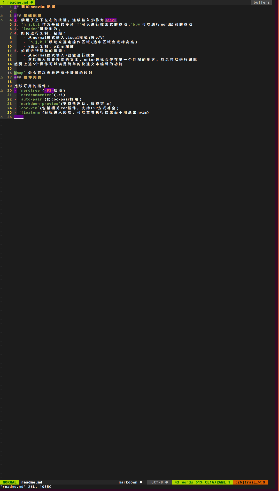

## 我的neovim 配置

### 基础配置
1. 禁用了上下左右的按键，连续输入jk作为<esc>
2. `h,j,k,l`作为基础的移动`f`可以进行搜索式的移动,`b,w`可以进行word级别的移动
3. `leader`键映射为,
4. 如何进行复制，粘贴：
    - 从normal模式进入visual模式(按v/V)
    - `h,j,k,l`移动来选定操作区域(选中区域会光标高亮)
    - y表示复制，p表示粘贴
5. 如何进行简单的搜索:
    - 从normal模式输入/就能进行搜索
    - 然后输入想要搜索的文本，enter光标会停在第一个匹配的地方，然后可以进行编辑
感觉上述5个操作可以满足简单的快速文本编辑的功能

`map` 命令可以查看所有快捷键的映射
### 插件列表

比较好用的插件：
- `nerdtree`(<F3>启动)
- `nerdcommenter`(,ci)
- `auto-pair`(比coc-pair好用)
- `markdown-preview`(支持热启动，快捷键,m)
- `coc-vim`(包括相关coc插件，支持LSP方式补全)
- `floaterm`(轻松进入终端，可以查看执行结果而不用退出nvim)
    
最终效果:

